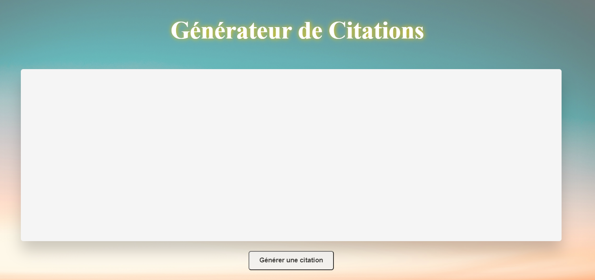

# 🖩 Web App - Générateur de citations aléatoires

Développement d'une application web qui génère des citations aléatoires, mettant en pratique les compétences en JavaScript pour manipuler le DOM et en CSS pour le style.

## 🌐 Technologies appliquées

- 
- 
- 

## 🛠️ Outils

- 

## 📷 Captures d’écran

## 🔗 Liens vers la démo
https://maeva-rodrigues.github.io/Mental_Arithmetic_App/

